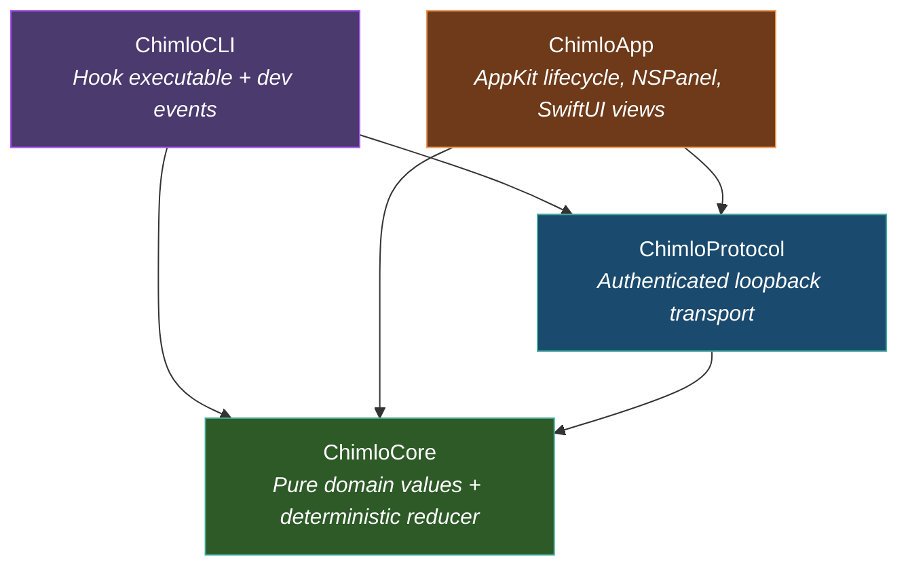

<p align="center">
  
  
  
  
  
</p>

# Chimlo

**An open-source macOS activity island for coding agents.**

Know what your AI agents are doing. See when they need you. Get back to work in one click.

Chimlo sits at the top of your display — a persistent, glanceable status surface for every local coding agent session. When Codex or Claude Code needs a decision, Chimlo surfaces it. When they're done, Chimlo tells you. When they're idle, an animated pixel character keeps you company.

<!-- TODO: Add a demo GIF or screenshot here for maximum impact
<p align="center">
  
</p>
-->

---

## ✨ Features

🖥️ **Native macOS** — Pure AppKit + SwiftUI. No Electron. No web views. Runs lean and fast.

📍 **Top-center island** — Adapts to notched displays, external monitors, and the menu bar.

🤖 **Multi-agent awareness** — Tracks Codex and Claude Code sessions simultaneously with unified local discovery.

❓ **Answer Claude in place:** Shows Claude Code's real multiple-choice questions and sends the selected option back to the blocked session.

⚠️ **Approve Claude in place:** Shows the real tool action with Deny, Allow Once, and session-only Allow All controls. Bypass mode is never exposed.

🎨 **Pixel art characters** — Original animated sprites for idle, working, waiting, done, and failed states.

🔒 **Privacy-first** — Prompts, transcripts, and session content never leave your Mac. Telemetry is absent by default.

⚡ **Authenticated local protocol** — Events flow through a loopback transport with per-launch tokens and bounded framing.

🛡️ **Fail-closed approvals** — A missing app, timeout, or transport error can never imply approval. The terminal stays in charge.

🔧 **Safe hook installation** — Previewed, marker-scoped merges that preserve your existing config. One-time backup. Clean uninstall.

♿ **Accessible** — Keyboard navigation, Reduce Motion support, and replayable onboarding.

---

## 🚀 Quick Start

**Requirements:** macOS 14+ and a Swift 6.0 toolchain (Xcode or Command Line Tools).

```sh
# Clone the repo
git clone https://github.com/kraten/chimlo.git
cd chimlo

# Run tests
make check

# Launch the app
./Scripts/swift.sh run ChimloApp
```

To build a standalone `.app` bundle:

```sh
make signing-identity # one-time; keeps Accessibility permission stable across builds
make app
open dist/Chimlo.app
```

The signing setup creates a dedicated local keychain, imports a non-exportable
private key, and restricts certificate trust to code signing. Contributors can
skip it, but ad-hoc builds may need Accessibility permission again whenever their
executable changes. Run `make signing-check` to prove two different builds keep
the same designated code requirement.

---

## 🔌 Agent Integrations

Chimlo discovers local agent sessions through four complementary signals — no cloud required:

| Signal | Source |
|:---|:---|
| **App-server metadata** | Codex desktop app task lifecycle |
| **Process liveness** | Terminal process discovery + working directory |
| **JSONL metadata** | Incremental reads of Codex/Claude session records |
| **Command hooks** | Codex and Claude Code observers plus narrow Claude question and permission bridges |

### Connect Codex

Open **Chimlo Settings → Connect** to preview and install marked observers into `~/.codex/hooks.json`. Chimlo preserves every existing hook and validates the result.

### Connect Claude Code

Open **Chimlo Settings → Connect** beside Claude Code to preview and install marked observers plus the `AskUserQuestion` and `PermissionRequest` bridges into `~/.claude/settings.json`. The same preservation, backup, fail-safe fallback, and marker-scoped removal rules apply.

📖 Full details in [Docs/AGENT_HOOKS.md](Docs/AGENT_HOOKS.md)

---

## 🏗️ Architecture

Chimlo has four deliberately narrow layers with strict dependency boundaries:



📖 Full details in [Docs/ARCHITECTURE.md](Docs/ARCHITECTURE.md) · Protocol spec in [Docs/PROTOCOL.md](Docs/PROTOCOL.md)

---

## 🧭 Principles

1. **Terminal-first** — The terminal remains authoritative when Chimlo is unavailable.
2. **Scoped actions** — A click only resolves the exact live request shown on screen.
3. **Non-destructive installation** — Never overwrites unrelated agent configuration.
4. **Local-only data** — Prompts, transcripts, and session details stay on the Mac.
5. **No telemetry** — Telemetry is absent by default.
6. **Original assets** — Every visual and audio asset has clear original provenance.

---

## 🤝 Contributing

Contributions are welcome! Please read the [Contributing Guide](CONTRIBUTING.md) and [Code of Conduct](CODE_OF_CONDUCT.md) before opening a PR.

**Quick links:**
- 🐛 [Report a bug](https://github.com/kraten/chimlo/issues/new?template=bug_report.yml)
- 💡 [Request a feature](https://github.com/kraten/chimlo/issues/new?template=feature_request.yml)
- 💬 [Discussions](https://github.com/kraten/chimlo/discussions)

---

## 📜 License

[GPL-3.0](LICENSE) — Product and integration names remain the property of their respective owners.

---

<p align="center">
  <sub>Built with ❤️ for developers who work alongside AI agents</sub>
</p>
