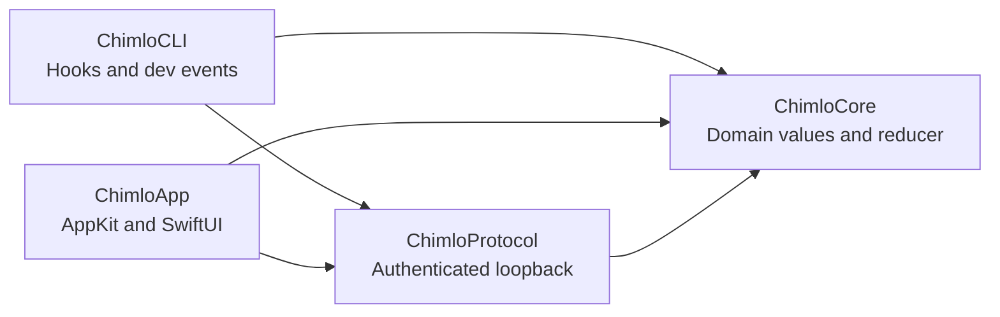

<h1 align="center">
  
  <br>
  Chimlo
</h1>

<p align="center">
  <strong>The macOS activity island for coding agents.</strong>
  <br>
  Watch Codex and Claude Code work, respond when they need you, then get back to your flow.
</p>

<p align="center">
  <a href="#install">Install</a> ·
  <a href="#features">Features</a> ·
  <a href="#connect-codex-and-claude-code">Connect agents</a> ·
  <a href="#architecture">Architecture</a> ·
  <a href="#contributing">Contribute</a>
</p>

<p align="center">
  <a href="https://github.com/kraten/chimlo/actions/workflows/ci.yml"></a>
  
  
  <a href="LICENSE"></a>
  <a href="https://github.com/kraten/chimlo/stargazers"></a>
</p>

---

Long-running agents should not make you babysit a terminal. Chimlo turns the top
of your display into a small, local control surface: active work stays visible,
questions and approvals arrive where you can act on them, and completed work is
easy to reopen.

## ✨ Features

- 🤖 **Live agent sessions.** Follow concurrent Codex and Claude Code work, including what is active, waiting, done, or failed.
- ❓ **Claude questions in place.** Read the real multiple-choice prompt and send the selected option back to the blocked session.
- 🛡️ **Scoped Claude approvals.** Inspect the requested tool action, then deny it, allow it once, or allow it for the current session. Bypass mode is never exposed.
- 📊 **Real provider capacity.** See Codex and Claude usage windows from provider-owned runtime data, without reading credentials or inventing percentages.
- 🍎 **Native macOS.** Chimlo is built with AppKit and SwiftUI. There is no Electron shell and no web view.
- 🎵 **A useful notch between tasks.** Media playback plus volume and brightness feedback share the same compact surface.
- 🖥️ **Display-aware behavior.** The island adapts to notched displays, external monitors, the menu bar, fullscreen media, Reduce Motion, and increased contrast.
- 👾 **Animated pixel companions.** Original characters make idle, working, waiting, completed, and failed states recognizable at a glance.
- 🔌 **Safe agent setup.** Previewed, marker-scoped hook installation preserves unrelated Codex and Claude Code configuration and removes only Chimlo's entries.
- 🔒 **Local and private.** Prompts, transcripts, permission previews, and session details are not sent to a Chimlo service. There is no telemetry by default.

## 📦 Install

Chimlo currently builds from source. You need macOS 14 or newer plus Xcode or
the Xcode Command Line Tools with a Swift 6 toolchain.

```sh
git clone https://github.com/kraten/chimlo.git
cd chimlo

# One-time local signing setup
make signing-identity

# Package and open Chimlo.app
make app
open dist/Chimlo.app
```

On first launch, complete the short onboarding tour and use **Settings >
Connect** to add the agent integrations you want. macOS may also ask for
Accessibility permission for volume and brightness feedback.

<details>
<summary>Why the local signing step matters</summary>

`make signing-identity` creates a dedicated local keychain, imports a
non-exportable private key, and restricts the certificate to code signing. This
keeps Chimlo's designated code requirement stable between local builds, so macOS
does not repeatedly forget its Accessibility permission.

You can skip the step for an ad-hoc build, but permission may need to be granted
again when the executable changes. Run `make signing-check` to verify that two
separate builds keep the same designated requirement.

</details>

### Develop locally

```sh
make build
make test
make check
./Scripts/swift.sh run ChimloApp
```

`make test` runs the Swift test suites. `make check` runs Chimlo's deterministic
layout, protocol, and behavior checks.

## 🔌 Connect Codex and Claude Code

Chimlo combines app-server events, process liveness, incremental local metadata,
and command hooks. No cloud connection is required.

| Client | What Chimlo installs |
|:--|:--|
| **Codex** | Marker-scoped observers in `~/.codex/hooks.json` for task lifecycle updates. |
| **Claude Code** | Marker-scoped observers plus the blocking `AskUserQuestion` and `PermissionRequest` bridges in `~/.claude/settings.json`. |

Every install starts with a complete preview and explicit confirmation. Chimlo
preserves unrelated configuration, creates a one-time backup, validates the
result, and removes only its own marked entries during uninstall.

Read [Agent hook setup](Docs/AGENT_HOOKS.md) for the full install, recovery, and
uninstall behavior.

## 🔒 Privacy and safety

Chimlo is designed so that the terminal remains authoritative.

- Question text, answers, permission paths, and action previews exist only in memory while the interaction is active.
- The local registry deliberately omits prompt and response content.
- Hook traffic uses an authenticated loopback protocol with per-launch tokens and bounded message framing.
- A missing app, timeout, authentication failure, or transport error never implies approval. Claude Code falls back to its native terminal UI.
- Capacity comes from the existing Codex app-server connection and Claude Code's documented status-line or `/usage` surfaces. Chimlo does not read provider credentials.

See the [protocol specification](Docs/PROTOCOL.md) for the wire format and
fail-closed behavior.

## 🏗️ Architecture

Chimlo keeps its platform code, transport, and domain model in narrow modules:



- **ChimloCore** owns deterministic session, interaction, retention, capacity, and layout rules.
- **ChimloProtocol** owns authenticated local transport and its wire schema.
- **ChimloApp** owns the macOS lifecycle, panel placement, discovery adapters, settings, and SwiftUI views.
- **ChimloCLI** receives agent hooks and provides development event injection.

Read the [architecture guide](Docs/ARCHITECTURE.md) for the dependency boundaries
and runtime data flow.

## 🤝 Contributing

Contributions are welcome. Start with the [contributing guide](CONTRIBUTING.md)
and [code of conduct](CODE_OF_CONDUCT.md), then open an issue or pull request.

- [Report a bug](https://github.com/kraten/chimlo/issues/new?template=bug_report.yml)
- [Request a feature](https://github.com/kraten/chimlo/issues/new?template=feature_request.yml)
- [Join a discussion](https://github.com/kraten/chimlo/discussions)

## 📜 License

Chimlo is free and open-source software licensed under
[GPL-3.0](LICENSE). Product and integration names remain the property of their
respective owners.
